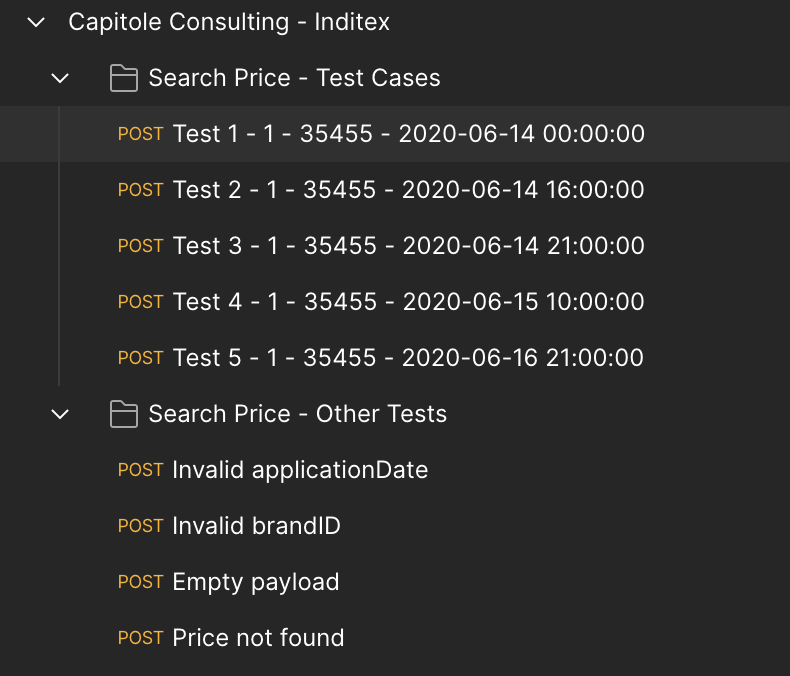
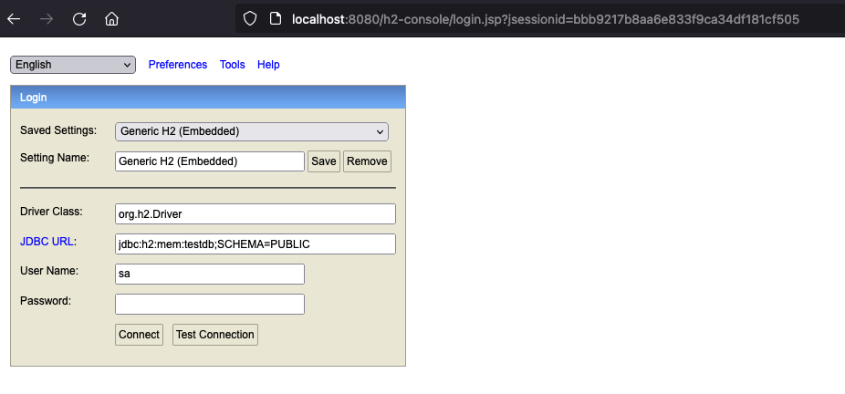
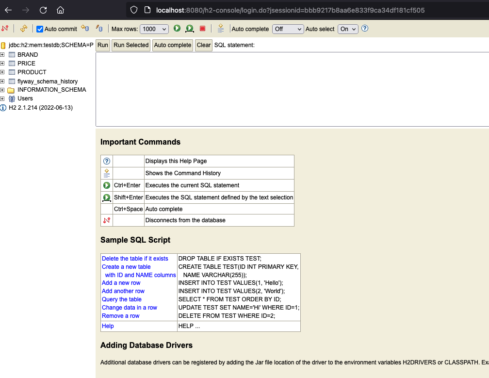
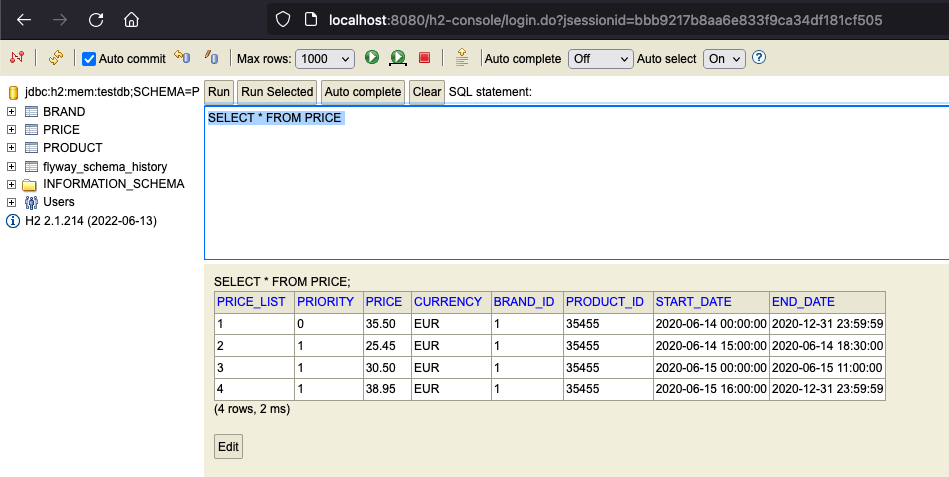

# Capitole Consulting - Inditex test

API REST de consulta de precios según:

- Fecha y hora;
- ID de producto;
- ID de marca.

Utiliza una base de datos en memoria H2.

Utiliza Flyway para migraciones de bases de datos.

# Endpoints expuestos y cURLs de ejemplo

**POST /api/v1/prices** *Request*

```
curl --location --request POST 'http://localhost:8080/api/v1/prices' \
--header 'Content-Type: application/json' \
--data-raw '{
    "applicationDate": "2020-06-14 00:00:00",
    "productID": 35455,
    "brandID": 1
}'
```

**POST /api/v1/prices** *Response*

```
{
    "productId": 35455,
    "brandId": 1,
    "rateId": 1,
    "finalPrice": 35.5,
    "startDate": "2020-06-14T00:00:00",
    "endDate": "2020-12-31T23:59:59"
}
```

## Ejecución en entorno local

Para levantar el servicio localmente vía el wrapper de Maven ubicarse en la raíz del proyecto y ejecutar (por defecto el servidor escucha en el puerto 8080):

```sh
./mvnw spring-boot:run
```

## Ejecución de tests unitarios y de integración

Para iniciar los tests unitarios y de integración vía el wrapper de Maven ubicarse en la raíz del proyecto y ejecutar:

```sh
./mvn test
```

Los resultados de la ejecución del anterior comando debiera ser similar a lo siguiente:

```
[INFO] 
[INFO] Results:
[INFO] 
[INFO] Tests run: 9, Failures: 0, Errors: 0, Skipped: 0
[INFO] 
[INFO] ------------------------------------------------------------------------
[INFO] BUILD SUCCESS
[INFO] ------------------------------------------------------------------------
[INFO] Total time:  10.802 s
[INFO] Finished at: 2023-09-04T18:26:47-03:00
[INFO] ------------------------------------------------------------------------
```

## Colección Postman

En la carpeta docs/postman se encuentra un archivo que tiene [variables de entorno](.docs/postman/environment.json) definidas que son utilizadas desde la [colección Postman](.docs/postman/collection.json).



Las peticiones que se encuentran dentro de la carpeta *Search Price - Other Tests* poseen algunos tests que se ejecutan posterior a la petición para validar códigos de estado HTTP y payload de la respuesta.

## Flyway para el manejo de migraciones

En la carpeta resources/db/migration del classpath del proyecto se encuentra la estructura por defecto que busca Flyway para ejecutar los scripts.
Hay 2 scripts:
- V1__Create_Tables.sql -> Ejecuta la creación de tablas (Brand, Product, Price) siempre y cuando no existan.
- V1.1__Inserts.sql -> Popula las tablas creadas en el script V1.

## H2 Console

Para acceder a la consola de administración de H2 ingresar a:

```
http://localhost:8080/h2-console
```



Ingresar con las credenciales configuradas en el archivo application.properties (password vacío).



Si se ejecuta un select sobre la tabla *prices* se pueden ver los registros insertados posterior a la inicialización de la aplicación.




